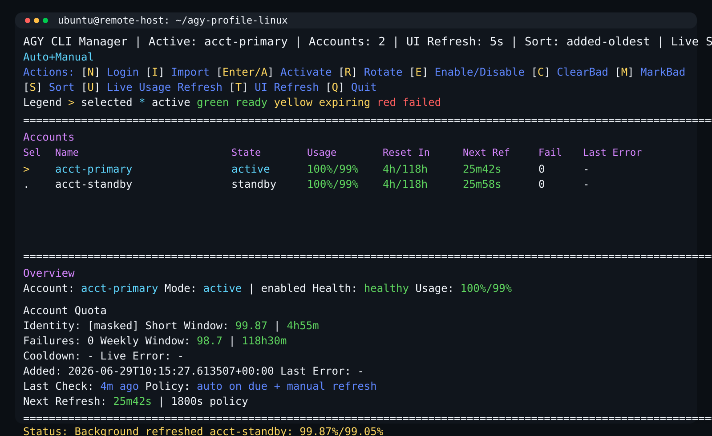

# agy-profile-linux

[](https://github.com/googol55middle-alt/agy-profile-linux/actions/workflows/test.yml)

[Project website](https://googol55middle-alt.github.io/agy-profile-linux/) · [Security policy](SECURITY.md)

`agy-profile-linux` is an independent Linux fork based on upstream 0.2.1. It is not affiliated with the upstream maintainers, Google, or Antigravity.

> **Security and credential warning:** OAuth credentials are stored locally as owner-readable files with restrictive permissions, but they are **not encrypted at rest**. Protect the host, backups, snapshots, home directory, and any custom `--root` directory. This project is not a password manager or a defense against malware, root access, or a compromised backup. See [SECURITY.md](SECURITY.md) before using real accounts.
>
> Commands such as `refresh-usage`, `refresh-due`, `whoami --probe-usage`, and model/identity probes may make authenticated requests or run `agy` with a copied credential profile. Use them only when that network or process activity is intended.

It keeps saved account credentials in an owner-private store and supports two ways to run `agy`:

- `switch <name>` changes only the live OAuth credential and account-bound project ID, like Windows `agy-profile`.
- `run -- <agy arguments>` uses a disposable isolated runtime when you do not want to touch the live home.
- shared `.gemini` settings, conversations, knowledge, skills, and MCP configuration stay in place during a live switch.
- a live switch refuses to proceed while `agy` is running unless you explicitly ask the manager to close it gracefully.

It is designed for one active account at a time:

- keep multiple saved `agy` profiles
- switch the active profile explicitly or after failure
- expose machine-readable state for external callers
- stay usable as a CLI app, TUI dashboard, or Python library

It is application-agnostic. A Telegram bot can call it, but the manager itself is not Telegram-specific.



## Before you start

This project is not the Antigravity CLI itself. It manages account files for an existing `agy` installation on Linux. It does not install `agy`, create a Google account, or perform login for you unless you use its isolated `login` command.

You need:

- a Linux system;
- Python 3.10 or newer;
- a working `agy` command that you can run and log in to; and
- at least one account that has completed login in `agy`.

In this README, an **account profile** means a named saved copy of the authentication files that the manager needs to switch accounts. The manager keeps that copy separate from your normal shared `.gemini` settings.

Related project:

- [upstream `agy-cli-manager`](https://github.com/zcop/agy-cli-manager) 0.2.1

This fork is independent and includes Linux-specific changes. Do not assume that an upstream release wheel contains the changes described here.

## What it does

- stores account profiles with restrictive permissions and atomic updates
- keeps one account active while others stay standby/cooldown/disabled
- supports isolated interactive `agy` login
- can import an existing `.gemini` profile from an explicit source path
- uses a private manager runtime for `run`, while normal `switch` updates only the live account files
- supports manual switching and optional failover policies
- prefers fuller, healthier standby accounts when auto-switching
- tracks cached identity, health, and usage metadata
- tracks live switch coordinator state for callers that need to wait on failover
- exposes CLI commands and JSON output for automation
- supports account failover with cooldowns and lock-protected state changes

## Limits

- Linux is the only supported platform. The implementation relies on Linux process and filesystem behavior.
- Credentials are protected by local file permissions, not encryption.
- Quota and health metadata can become stale. A real request result remains the final authority.
- Automatic switching is optional and requires `auto` mode plus an eligible standby account.
- The manager coordinates account changes; the calling application decides whether and when to retry failed work.

## Requirements

- Linux
- Python 3.10+
- a working `agy` binary available in `PATH`, or passed explicitly with `--agy-binary`
- a terminal if you want to use `login` or the full-screen dashboard

## Install

Read [LOCAL_HARDENING.md](LOCAL_HARDENING.md) before importing an account or running `agy` through this fork.

Do **not** replace this build with an upstream release wheel: the upstream release does not contain these local security changes.

Open a terminal on the machine where you want to install the project. Copy and paste this entire block:

```bash
git clone https://github.com/googol55middle-alt/agy-profile-linux.git
cd agy-profile-linux
python3 -m venv .venv
. .venv/bin/activate
python -m pip install --upgrade .
```

These commands download the project into a new `agy-profile-linux` directory and install it in a local Python environment inside that directory.

After installation, verify the command is available:

```bash
agy-profile-linux --help
```

`run` requires an initialized manager with an active saved account; follow the Quick Start steps below before using it.

## Quick Start

The shortest first-run path is: install this manager, initialize it, save the account you are already using, then create additional profiles with the isolated login flow.

### 1. Initialize the manager state

```bash
agy-profile-linux init
```

By default, state lives under:

```text
~/.agy-profile-linux
```

You can override that with `--root /path/to/root`.

### 2. Save the account you are currently using

This matches Windows `agy-profile save personal`:

```bash
agy-profile-linux save personal
```

Each saved account profile copies only the OAuth credential and account-bound project ID. Separate manager state records non-credential data such as identity, health, usage, cooldowns, and switch history. It does not copy your shared `.gemini` settings, conversations, knowledge, skills, or MCP configuration.

To create another saved account, use the isolated interactive login flow:

```bash
agy-profile-linux login work
```

Complete the normal Google login in `agy`, then exit it. The manager saves that account without changing the live account.

### 3. Switch accounts quickly

Stop `agy` first, then switch the live account:

```bash
agy-profile-linux switch work
agy
```

Switching replaces only the live OAuth credential and account-bound project ID. The next plain `agy` command uses the selected account, just as it would after a manual logout/login.

### 4. Check what is active

```bash
agy-profile-linux status
agy-profile-linux current
agy-profile-linux list
```

### 5. Open the dashboard

```bash
agy-profile-linux
```

With no subcommand, the full-screen dashboard opens by default.

## First useful commands

```bash
agy-profile-linux status --json
agy-profile-linux whoami
agy-profile-linux models --json
agy-profile-linux ensure-active --json
agy-profile-linux switch-mode
agy-profile-linux switch-mode manual
agy-profile-linux switch-mode auto
agy-profile-linux switch-policy --json
agy-profile-linux switch-policy --short-threshold 10 --refresh-failure-threshold 2 --candidate-strategy balanced
agy-profile-linux refresh-usage --json
agy-profile-linux switch-next
agy-profile-linux rotate-after-failure --reason quota --cooldown-minutes 60 --json
```

The current switch policy is stored in manager state and can be controlled by either:

- CLI: `switch-mode`, `switch-policy`, `ensure-active`
- Python API: `get_status_snapshot()`, `get_switch_policy()`, `update_switch_policy()`, `ensure_active_account()`

Directory layout:

```text
~/.agy-profile-linux/
├── accounts/
│   └── <account-name>/
│       └── .gemini/
│           └── ...
├── runtime/
│   └── .gemini/
└── state.json
```

## Live switching and isolated runtime

The normal `switch <name>` command follows the Windows `agy-profile` model. It updates only these account-bound files in your normal `~/.gemini` home:

```text
antigravity-cli/antigravity-oauth-token
antigravity-cli/cache/default_project_id.txt
```

All other `.gemini` data stays shared. By default the manager checks for a running `agy` process and refuses to switch. To explicitly let it request a graceful close of same-user `agy` processes using the normal live home, use:

```bash
agy-profile-linux switch account1 --close
```

The close operation sends `SIGTERM` only; it waits up to 10 seconds and never force-kills. It does not target isolated sessions or processes using another `HOME`. If `agy` does not exit, the switch is aborted and you can close it manually. You can change the wait limit with `--close-timeout-seconds 20`.

The manager then takes a private rollback snapshot, performs the switch while holding its manager lock, and restores the previous files if the operation fails.

If you prefer not to touch the live home, use the isolated runner:

```bash
agy-profile-linux run -- <agy arguments>
```

For the old isolated switch behavior, use:

```bash
agy-profile-linux switch account1 --isolated
```

A direct `agy` command uses the normal home. After `agy-profile-linux switch account1`, that is the intended command to run.

Legacy `live_dir` synchronization remains disabled. If state from an older build contains a `live_dir`, clear it with:

```bash
agy-profile-linux set-live-dir
```

Commands:

```bash
agy-profile-linux
agy-profile-linux dashboard
agy-profile-linux menu
agy-profile-linux init
agy-profile-linux run -- <agy arguments>
agy-profile-linux list
agy-profile-linux current
agy-profile-linux status
agy-profile-linux status --json
agy-profile-linux ensure-active
agy-profile-linux switch-mode
agy-profile-linux switch-mode manual
agy-profile-linux switch-mode auto
agy-profile-linux switch-policy
agy-profile-linux refresh-usage
agy-profile-linux refresh-usage account1 --json
agy-profile-linux refresh-due
agy-profile-linux refresh-due --json
agy-profile-linux models
agy-profile-linux models --json
agy-profile-linux models account1 --json
agy-profile-linux whoami
agy-profile-linux whoami account1 --refresh
agy-profile-linux whoami account1 --probe-usage --agy-binary /path/to/agy
agy-profile-linux add account1 /path/to/source
agy-profile-linux import-current account1 /path/to/.gemini
agy-profile-linux save account1
agy-profile-linux login
agy-profile-linux login account1 --agy-binary /path/to/agy
agy-profile-linux activate account1
agy-profile-linux switch account1
agy-profile-linux switch account1 --isolated
agy-profile-linux rotate
agy-profile-linux switch-next
agy-profile-linux disable account1
agy-profile-linux enable account1
agy-profile-linux mark-bad account1 --reason quota --cooldown-minutes 60
agy-profile-linux clear-bad account1
agy-profile-linux set-live-dir
agy-profile-linux apply-active
agy-profile-linux switch-mode manual
agy-profile-linux rotate-after-failure --reason quota --cooldown-minutes 60 --json
agy-profile-linux rotate-after-failure --reason quota --cooldown-minutes 60 --force-switch --json
agy-profile-linux update-meta account1 --usage-status known --usage-value 42 --reset-at 2026-07-01T00:00:00+00:00 --health-status healthy --last-live-check-at 2026-06-30T06:00:00+00:00 --next-live-check-at 2026-06-30T06:30:00+00:00 --refresh-policy-seconds 1800
agy-profile-linux update-meta account1 --short-usage-status known --short-usage-value 97.57 --short-reset-at 2026-07-01T00:00:00+00:00 --weekly-usage-status unknown
```

`add` accepts either:

- a directory that is already a `.gemini` profile root
- or a parent directory containing `.gemini/`

## Development checks

From a fresh checkout, run the test suite with the source directory on `PYTHONPATH`:

```bash
PYTHONPATH=src python -m unittest discover -s tests -p 'test_manager_hardening.py' -v
python -m py_compile src/agy_profile_linux/*.py tests/test_manager_hardening.py
python -m pip wheel --no-deps . --wheel-dir dist
```

The GitHub Actions workflow runs these checks on Python 3.10, 3.11, and 3.12.

## JSON/API-oriented usage

For automation, prefer the JSON-capable commands:

```bash
agy-profile-linux status --json
agy-profile-linux current --json
agy-profile-linux list --json
agy-profile-linux ensure-active --json
agy-profile-linux switch-policy --json
agy-profile-linux switch-policy --short-threshold 12.5 --refresh-failure-threshold 3 --candidate-strategy highest-short --json
agy-profile-linux refresh-usage account1 --json
agy-profile-linux refresh-due --json
agy-profile-linux models --json
agy-profile-linux rotate-after-failure --reason quota --cooldown-minutes 60 --json
```

Typical external-app flow:

1. read current state with `status --json`
2. call `ensure-active --json` before sending real work if you want the manager to preflight the active account
3. read `switch_mode` and `switch_policy` to decide how aggressively your caller should auto-fail over
4. use `models --json` if the caller needs model choices for the active account
5. call `refresh-usage --json` or `refresh-due --json` only when needed
6. if a real request fails due to auth/quota, call `rotate-after-failure --json`
7. inspect `switch_runtime` or wait briefly until it leaves `switching`
8. retry the real request once on the new active account
9. persist caller-side observations back with `update-meta`

Notes:

- running `agy-profile-linux` with no subcommand opens the full-screen dashboard
- `dashboard` is a TTY-only full-screen view with a fast local-only UI refresh and manual account actions
- `list`, `current`, `activate`, and `rotate` are convenience commands for standalone use; they map to the same manager state as the lower-level commands.
- local operator notes such as `AGENTS.md` are intentionally kept untracked and are not part of the public repo contract.
- `agy-profile-linux login` prompts for the account name if you do not pass one
- `switch-next` skips accounts in cooldown.
- `mark-bad` clears the active pointer if that account was active.
- `ensure-active` evaluates the current policy and can automatically recover from no active account, known low 5-hour quota, auth missing, or repeated refresh failures.
- `ensure-active` returns JSON with `switch_runtime`, so callers can see whether the manager is idle, switching, ready, or has no standby account available.
- `switch-mode` controls whether `rotate-after-failure` automatically moves to the next eligible standby account or stops after marking the active account bad.
- `switch-policy` controls the proactive short-window threshold, refresh-failure threshold, and standby candidate ranking strategy.
- state and switching are protected by a single lock file so a caller can safely trigger failover from another process.
- `run` holds that lock while it runs `agy` with `HOME` set to the private runtime.
- `set-live-dir` clears only a legacy setting; assigning a real CLI home is disabled in this fork.
- the manager currently copies the managed profile under `.gemini/`, centered on the Antigravity auth/token artifacts it needs for switching.
- it supports Antigravity-style `antigravity-cli/antigravity-oauth-token` auth storage and related identity extraction.
- `login` hands the terminal directly to a real `agy` session in a disposable home; complete onboarding/login there, exit `agy`, and the manager saves the captured profile snapshot.
- `login` stores the profile under the detected account name when available, not just the typed label.
- if that detected account already exists, `login` warns and asks whether to overwrite the saved profile.
- `whoami` reports the detected signed-in account name from profile metadata, and `--probe-usage` can additionally run `agy -p /usage` against that profile as a live check.
- `models` runs `agy models` for the active account or a named saved profile and can return structured JSON for external callers.
- the manager intentionally does not use scripted PTY startup probing for `agy`; profile switching is filesystem-based and runtime health should come from real request success/failure in the caller.
- in `auto` mode, `ensure-active` and `refresh-usage`/`refresh-due` can proactively switch away from an active account when the cached 5-hour window falls to the configured `short_usage_threshold_percent`, auth is missing, or refresh failures reach the configured threshold.
- cached quota is advisory; real runtime failure is still the final authority for callers such as bots.
- when auto-switching, the manager ranks the standby pool and prefers accounts with better health and more remaining short-window quota instead of simply taking the first account by name.
- the default switch policy is `short_usage_threshold_percent=10`, `refresh_failure_threshold=2`, `candidate_strategy=balanced`.
- `rotate-after-failure` is the public failover operation for external apps: mark the current active account bad, optionally put it in cooldown, then switch to the next eligible standby account.
- `rotate-after-failure` is idempotent across a short dedupe window and reports an `outcome` such as `switched`, `already_switched`, or `no_candidate`.
- `switch_runtime` is persisted in state so a caller can coordinate retry logic without racing another caller into a second switch.
- `rotate-after-failure` follows the persisted switch mode by default: `auto` attempts failover, `manual` leaves the manager inactive until an operator or caller explicitly switches accounts. Use `--force-switch` to override that for one run.
- `update-meta` lets an external app persist cached runtime metadata such as usage, reset time, health, last check, and next refresh time.
- `refresh-due` is the non-interactive refresh entrypoint for cron/systemd/external callers; it refreshes the active account first when due, otherwise the first due eligible standby account.
- usage metadata is stored under `usage_windows.short` and `usage_windows.weekly`; the old flat `usage_*` and `reset_at` fields remain as compatibility aliases for the short window.
- dashboard keybindings: `Up/Down` or `j/k` move, `n` login, `i` import, `Enter` or `a` activate, `r` rotate, `w` toggle switch mode (`auto`/`manual`), `e` enable/disable, `c` clear bad, `m` mark bad, `s` cycle sort (`added`, `usage`, `countdown`), `u` local refresh, `t` cycle UI refresh (`5s/10s/15s/30s`), `q` quit.
- dashboard overview now shows both account quota state and switch coordinator state.

Cached runtime metadata:

- usage/reset/health data is persisted in manager state
- the dashboard list currently uses the short window for its usage and countdown columns
- the selected-account panel shows both the short window and a reserved weekly window slot
- on relaunch, the dashboard reuses cached metadata immediately
- countdowns and freshness are recalculated locally from saved timestamps
- external apps should update this metadata after real checks or real requests
- fast dashboard refresh does not itself perform live checks

Python usage:

```python
from pathlib import Path

from agy_profile_linux import (
    build_paths,
    get_status_snapshot,
    get_switch_policy,
    list_models,
    rotate_after_failure,
    update_switch_policy,
)

paths = build_paths(Path.home() / ".agy-profile-linux")
snapshot = get_status_snapshot(paths)
policy = get_switch_policy(paths)
update_switch_policy(paths, short_usage_threshold_percent=12.5, candidate_strategy="highest-short")
models = list_models(paths)
result = rotate_after_failure(paths, reason="quota", cooldown_minutes=60)
print(snapshot["active"], "->", result.switched_to)
print(policy)
print([model["name"] for model in models["models"]])
```

Public Python API:

- `build_paths(root)`
- `ensure_layout(paths)`
- `get_status_snapshot(paths)`
- `get_switch_policy(paths)`
- `update_switch_policy(paths, ...)`
- `ensure_active_account(paths, force=False)`
- `list_models(paths, name=None, ...)`
- `refresh_account_usage(paths, name=None, ...)`
- `refresh_due_account(paths, ...)`
- `switch_account(paths, name)`
- `switch_next(paths)`
- `run_active(paths, agy_binary=None, agy_args=None)`
- `rotate_after_failure(paths, reason, cooldown_minutes=60, force_switch=False)`
- `set_switch_mode(paths, mode)`
- `set_live_dir(paths, None)` (clear legacy state only)
- `update_account_runtime_metadata(paths, name, ...)`

Important returned state:

- `get_status_snapshot(paths)` includes `switch_runtime`
- `ensure_active_account(...)` reports the active account decision
- `rotate_after_failure(...)` returns a `RotationResult` with `outcome`

`switch_runtime` has these practical states:

- `idle`: no failover is happening
- `switching`: a caller has started coordinated failover
- `ready`: failover finished and an active account is set
- `no_account`: failover finished but no eligible standby account was available

More explicit example:

```python
from pathlib import Path

from agy_profile_linux import build_paths, ensure_layout, list_models

paths = build_paths(Path.home() / ".agy-profile-linux")
ensure_layout(paths)

payload = list_models(paths)
for model in payload["models"]:
    print(model["name"], model["variant"])
```
